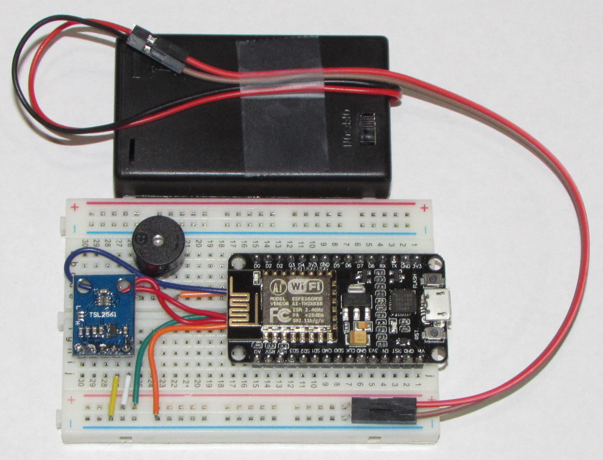
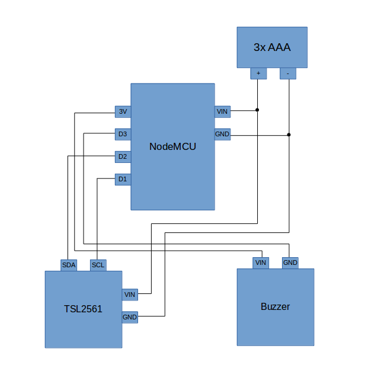

# wifi annoyotron

*wifi-enabled practical joke noisemaker, not for use with spouse*



## tl;dr

everyone's heard of the "annoyotron", a practical joke device that emits beeps
at random intervals, best used hidden behind a desk or under a refridgerator or
some other nefarious place.  enter the wifi-enabled annoyotron: these annoyotrons
form a network, with only one active at a time; they use their luminosity sensors
to detect when you have almost found the active one, then switch to another node
at random.

[source code](http://github.com/esialb/annoyotron/) for the microcontroller
program available on github.  parts are available on amazon, or aliexpress if
you want them in bulk.

## parts list

- nodemcu wifi microcontroller (esp8266 with arduino support)
- tsl2561 i2c luminosity sensor
- buzzer
- breadboard + wires
- battery holder

## hookup



## source code

[Source code](http://github.com/esialb/annoyotron/) is available on github.
The code is an [Eclipse](http://www.eclipse.org/) CDT project built with
[PlatformIO](http://platformio.org/).

## pseudocode

```
If IsActive: Then # If currently active
  If LuminosityChanged(): Then # Check if the light sensor detected a change
    # Become inactive
    IsActive = False
    DisableWifiAccessPoint()
    Return
  EndIf
  If ShouldEmitAnnoyance(): Then # Probabilistic annoyance emission
    EmitAnnoyance()
  EndIf
  Delay(100ms)
Else: # Not currently active
  If ScanForWifiAccessPoint(): Then # Look for another active node
    ActivationWait = LargeRandomWaitTime() # Pick a random wait time for later
  Else: # If there is no active node...
    If ActivationWait <= 0: Then # ... And if we are done waiting
      # Become active
      IsActive = True
      EnableWifiAccessPoint()
      EmitAnnoyance()
      Return
    EndIf
    # Otherwise wait a random time
    SmallWait = SmallRandomWaitTime()
    Delay(SmallWait)
    ActivationWait = ActivationWait - SmallWait
  EndIf # End if no active node
EndIf # End if not currently active
```
